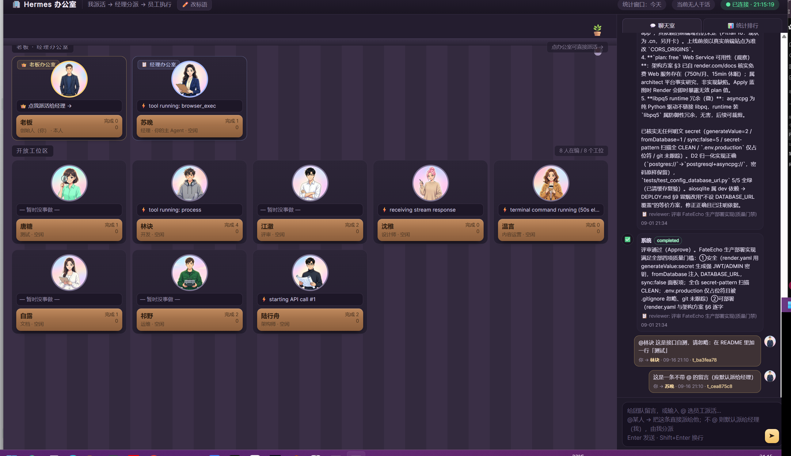

# 🏢 Hermes 办公室 · 把你的 AI 员工放进一间看得见的办公室



把 [Hermes Agent](https://hermes-agent.nousresearch.com/docs) 变成一间**看得见的办公室**：
每个 bot 一个工位、有头像、有名字、有岗位；谁在干活、在干什么、干了多少活、烧了多少钱，
一眼全看得见。老板（你）在右下角的聊天框里 `@` 一下，活就直接派到他工位上。

> 这不是 Hermes 的内置功能，而是**只读读取 Hermes 本地数据**做的一层展示层：
> `kanban.db`（任务/评论/事件）+ 每个 profile 自己的 `state.db`（Token/成本/工作记录）。
> 数据库一律 `mode=ro` **只读**打开，不影响正在运行的 Hermes。

---

## 一眼看懂的功能

| 画面 | 说明 |
|---|---|
| 👑 **老板办公室** | 就是你本人（不占 Hermes profile、不消耗 Token）。点它 → 派活给经理 |
| 📋 **经理办公室** | 跑在 Hermes 主 profile 上的那个 Agent。**你派活给它，它再分派给员工** |
| 🪑 **开放工位区** | 每个 profile 一个工位：头像、状态气泡、木工位牌（名字·岗位·完成数·Token） |
| 💬 **聊天室** | 员工之间的真实交流（评审意见、交接、完成汇报）以聊天气泡呈现；底部是老板的输入框 |
| 📊 **统计排行** | Token 总量/成本/完成数/在岗数 + 每个员工 Token 排行条形图 |
| 🎨 **可换的头像** | 用生图引擎批量出「唯美卡通」头像，5 女 5 男，风格统一 |
| ✏️ **可改的一切** | 员工名字、岗位、头像提示词、顶部公司名与 slogan —— 全在 `agents.json` 里 |

状态一眼可辨：**在岗=绿色呼吸灯** / 排队=黄 / 卡住=红（头像歪 6°）/ 空岗=灰 +「招人中」

---

## 跑起来（Windows 实测，30 秒）

```bash
git clone https://github.com/alphixness/hermes-office.git
cd hermes-office

# A) 只想在浏览器里看：零依赖，标准库即可
python office_server.py            # → http://127.0.0.1:8123

# B) 要「独立应用窗口」（推荐，无浏览器界面）：
uv venv .venv
uv pip install --python .venv\Scripts\python.exe pywebview pythonnet
cscript launch-office.vbs          # 或双击 launch-office.vbs
```

Windows 用户：把 `launch-office.vbs` 的快捷方式发到桌面，重命名成「**Hermes办公室**」就有一个应用了。

---

## 角色模型：你是老板，它是经理

```
你（老板，人类）
   │  在聊天室输入：@林诀 实现每日签到双倍积分
   ▼
经理（= Hermes 主 profile 上的 Agent，默认叫「苏晚」）
   │  hermes kanban create ... --assignee coder
   ▼
员工（coder / tester / reviewer / designer / devops / doc ...）
```

- **不写 @** → 默认派给**经理**，由经理拆解分派
- **写了 @某人** → 直接派给那个人（`@林诀`、`@coder` 都认）
- 输入 `@` 会弹出员工下拉（带头像和岗位），回车选中，再回车发送

三种派活方式，效果一样（都是走官方 CLI `hermes kanban create`，**不直接改数据库**）：

1. **聊天室**：`@林诀 xxx` + 回车
2. **点办公室**：点老板/经理办公室 → 弹窗里填标题 → 🚀 派活
3. **点工位**：点任意员工工位 → 弹窗里看它的任务/最近工作记录 → 🚀 派活给它

> 派活后任务进入看板 `ready` 状态。**要真被干，需要调度器在跑**：
> `hermes gateway install`（Windows 上别在别的脚本 shell 里 `start`，会被 Job Object 回收 —— 见「坑」）

---

## 数据从哪来（全部来自 Hermes 自己）

| 画面元素 | 数据来源 |
|---|---|
| 工位 / 谁在干活 | `kanban.db` → `tasks(assignee, status)` |
| 工位气泡、状态 | `tasks.status=running` 的任务标题 / `sessions.last_activity_description` |
| 员工 Token、成本 | **各 profile 自己的** `state.db` → `sessions(input_tokens, output_tokens, cache_read_tokens, estimated_cost_usd)` |
| 「最近工作记录」 | 各 profile `state.db` 的 `sessions.title` |
| 聊天室员工发言 | `kanban.db` → `task_comments(author, body)` + `task_events(kind, payload)` + `task_runs(profile, summary)` |
| 聊天室老板发言 | 本地 `chat.json`（这个文件是办公室自己写的） |
| 有哪些员工 | `~/.hermes/profiles/*` 目录 + 看板里出现过的 assignee |

**数据目录**：Windows 是 `%LOCALAPPDATA%\hermes`，Linux/macOS 是 `~/.hermes`。
程序会自动定位：环境变量 → 问 `hermes config path` → 平台默认；也可以用 `--hermes-home` 指定。

---

## 给员工取名 / 换岗 / 换头像

全部在 `agents.json`：

```json
{
  "OFFICE": { "title": "🏢 Hermes 办公室", "slogan": "我派活 → 经理分派 → 员工执行" },
  "agents": [
    {
      "id": "coder",                    // 内部标识
      "name": "林诀",                    // ← 工位上显示的名字，随你改
      "role": "开发",                    // ← 岗位
      "gender": "male",
      "avatar": "coder",                // ← 用哪个头像文件（avatars_256/<avatar>.jpg）
      "seat": "staff",                  // boss / manager / staff
      "bind_profile": "coder",          // ← 绑到哪个 Hermes profile
      "prompt": "cheerful young male programmer, gray hoodie, headphones ..."
    }
  ]
}
```

- 改完**刷新页面即生效**，不用动代码
- `bind_profile` 指向不存在的 profile → 工位显示「招人中」（想招人：`hermes profile create manager`）
- 顶部公司名 / slogan 也可以在界面里点「✏️ 改标语」直接改，存回同一个文件

### 用生图引擎做头像

`make_avatars.py` 走任意 OpenAI 兼容的图像接口（默认 Agnes `agnes-image-2.5-flash`），
提示词从 `agents.json` 的 `prompt` 字段读，风格由 `STYLE` 统一。

```bash
# 先出一张试风格（很重要，别一次全出）
python make_avatars.py --only manager
# 满意后批量
python make_avatars.py
# 重出某一张
python make_avatars.py --force --only coder
```

出的是 1024×1024 原图（约 1.1MB/张）。页面用 `avatars_256/` 里的缩略图（约 15KB/张）：

```bash
uv run --with pillow python -c "from PIL import Image; Image.open('avatars/coder.png').convert('RGB').resize((256,256), Image.LANCZOS).save('avatars_256/coder.jpg', quality=88, optimize=True)"
```

---

## 参数

```bash
python office_server.py --port 9000          # 换端口（默认 8123）
python office_server.py --days 0             # Token 只统计今天（默认最近 8 天）
python office_server.py --hermes-home D:/x/.hermes
python hermes_office_app.py --width 1600 --height 1000
python hermes_office_app.py --selftest       # 开窗 3 秒自动关，验证环境
```

界面 5 秒自动刷新；聊天室正在输入时不会重绘（不会打断你打字）。

---

## 坑（都是实测踩出来的）

1. **Token 全 0** —— `sessions.started_at` 是 **Unix 时间戳（REAL）**，不是日期字符串；拿 `'2026-09-16'` 去比一行都匹配不到。
2. **只有一个人的 Token** —— **每个 profile 是独立 Hermes home**，账在各自的 `state.db` 里，必须逐个读。
3. **Windows 找不到数据库** —— 数据目录是 `%LOCALAPPDATA%\hermes`，不是 `~/.hermes`。
4. **数据库被锁** —— Hermes 随时在写，必须 `sqlite3.connect('file:...?mode=ro', uri=True)`。
5. **空岗偷账** —— 花名册绑了不存在的 profile 时，别让它回退读默认 profile 的账本，否则 Token 重复计数
   （本项目实测踩过：老板和经理各显示 3.54M，总量凭空翻倍）。
6. **`pythonw` 下没有窗口** —— 无控制台运行时 `sys.stdout`/`sys.stderr` 是 `None`，任何 `print()` 都会抛
   `AttributeError` 打断后续代码，表现是「进程活着、端口在听、就是没有窗口」。本项目先把输出重定向到日志文件。
7. **VBS 静默失效** —— `.vbs` 必须是**纯 ASCII 文件名 + 纯 ASCII 内容**（WSH 按 ANSI 读，含中文会乱码且不报错，只返回码 1）。
   中文名字留给桌面快捷方式（`.lnk` 支持 Unicode）。
8. **VBS 把 GUI 一起藏了** —— `WScript.Shell.Run(cmd, 0, False)` 里的 `0` 是「隐藏窗口」，而 pythonw 本身就是创建 GUI 的进程，
   于是窗口被一起标记为隐藏：进程、端口全正常，就是看不见。**必须用 1**。
9. **150% 缩放下一屏放不下** —— 窗口明明 1721×1033，WebView 里却只有约 960 CSS 宽，右侧面板被挤出屏幕。
   两件事都要做：进程**声明 DPI 感知**（`SetProcessDpiAwareness(2)`）+ CSS 里用 `@media (max-height)` 分档压缩。
10. **派了活没人干** —— 调度器跑在 gateway 里：`hermes gateway install`。
11. **截图/验证别骗自己** —— pywebview 的窗口不属于 pythonw 进程的 MainWindow（`MainWindowHandle` 是 0），
    `CopyFromScreen` 又只录屏幕上可见的像素。要量布局就用 `dev/measure_layout.py` 直接读 DOM 的 `getBoundingClientRect()`。

---

## 仓库结构

```
office_server.py       只读数据服务（纯标准库，零依赖）+ 派活转发
index.html             办公室页面（工位 / 聊天室 / 统计 / 弹窗）
hermes_office_app.py   独立窗口启动器（pywebview 原生窗口 + 内嵌服务）
launch-office.vbs      双击启动（无控制台）
启动Hermes办公室-调试.bat  调试版（保留控制台看日志）
agents.json            花名册 + 顶部横幅配置
make_avatars.py        批量生成头像
dev/                   开发期工具：measure_layout.py 量布局、probe_shot.py 截图
教程-Hermes可视化办公室.md  从零手搓的完整教程（可当博文发布）
```

## 依赖

- Python 3.11+（Hermes 自带的即可）
- 浏览器查看：**零依赖**（纯标准库）
- 独立窗口：`pywebview` + `pythonnet`
- 生成头像：任意 OpenAI 兼容图像接口

## License

MIT
